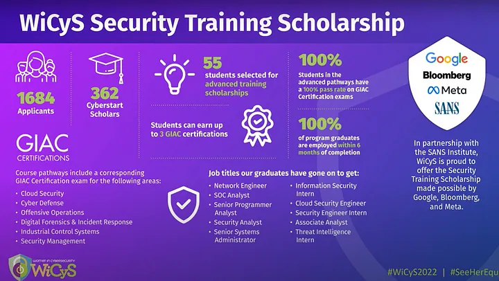

“Why am I a dummy?” — No tech skills, no tech degrees, no professional work experience, and English as my second language — I think I’m not a smart person either. But here’s the thing: if I can do it, so can you.

What makes the WiCys scholarship my DREAM scholarship? I recently secured the WiCys Security Training Scholarship, which includes Sans SEC 275, 401, and 504 — some of the most valuable certifications in the field of cybersecurity, totaling a whopping 20,000$ in value. And that’s not all — I also received a conference scholarship in April for an event in US. This scholarship covers everything from a flight ticket to hotel accommodations, ect providing a fantastic opportunity to network with professionals and meet fellow WiCys members. It’s also a chance to connect with organizations that share my passion for cybersecurity.

What are my thoughts on WiCys? I feel grateful for discovering WiCys and becoming a part of the WiCys community. It is a powerful community for empowering women in the field of cybersecurity, like a sisterhood where women are encouraged and supported to pursue success in cybersecurity. Through WiCys, I believe that it opens up new opportunities, allowing me to explore a world of possibilities and discover my true potential in cybersecurity.

## My preparation journey:

- **Connect with the WiCys Community:** Joining the WiCys Facebook group with over 12,000 members. The community provides a supportive environment where you can ask questions and seek advice. Additionally, reaching out to WiCys via email at info@wicys.org has proven effective, given their prompt responsiveness.
- **Become a WiCys Member:** There are six membership registration categories, and as someone outside the conventional student, professional, or U.S. military categories, the options may appear daunting. However, for non-traditional candidates like me, selecting the “industry professional” category and indicating ‘0–2’ experience years is advisable. This allows you to obtain a member ID, a requirement for scholarship applications. It’s also important to note that this opportunity is open to individuals worldwide.
- **Stay Informed:** WiCys constantly offers various scholarship programs. Stay updated by regularly checking their website and news section.
- **Craft an Outstanding Scholarship Application:** When applying for WiCys scholarships, your essay is a key component. Even if you’re transitioning from a completely different field, express your passion for cybersecurity and your dedication to a career change. Showcase your commitment, and let them understand why you deserve the opportunity.
- **Dive into Capture The Flag (CTF) Challenges:** Discovering the importance of CTF challenges in the WiCys scholarship process, I committed myself to intensive practice on various platforms such as PicoCTF, TryHackMe, Hack The Box, and SANs Holiday Hack Challenge were invaluable resources for sharpening my skills. I find PicoCTF particularly beginner-friendly, especially for someone like me who is new to playing CTF. I’d like to suggest a YouTube channel called Almost Force, where you can find write-up videos to help you in solving PicoCTF challenges. Most importantly, document your methods and take notes, as they will serve as valuable references during the scholarship stages.
- **Embrace the learning journey wholeheartedly:** The scholarship application process consists of several stages, and WiCys will select candidates through a sequential elimination process, evaluating applicants at each stage before progressing to the next. In the first stage, completing the CTF game gains a wealth of knowledge and enjoyable experiences. As you advance to stage 2, engage with Cyberstart, a platform rich in resources and manual fields that offer continuous learning opportunities alongside CTF gameplay with 248 challenges. Unfortunately, I received an email notifying me that the CyberStart platform will be fully closed down in early 2024. Moving on to stage 3, challenge yourself with CybergenIQ. It’s important to note that this test can be taken only once. Even if you don’t secure a scholarship this year, you have the chance to reapply the following year without retaking the CybergenIQ test. During this stage, WiCys evaluates your essay, emphasizing its pivotal role in securing the scholarship. Emphasize the importance of continual learning, as each stage contributes to your growth and proficiency in the dynamic field of cybersecurity.

And there you have it — a glimpse into my journey, experiences, and preparations aimed at securing a scholarship with WiCys.