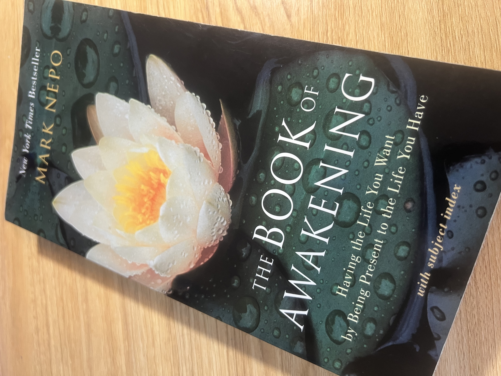

If you’re searching for a book that offers daily peace, healing, and inspiration, The Book of Awakening by Mark Nepo is a gentle treasure. Written by a poet and cancer survivor, this book is filled with short, powerful reflections for each day of the year. Every page holds a meaningful story or insight—some drawn from nature, some from Nepo's life—that speaks directly to the soul.
Whether you're feeling lost, overwhelmed, or simply need a moment of calm in your day, this book can be a guide. It helps you reconnect with yourself, breathe deeply, and find beauty even in difficulty. I’ve found comfort, motivation, and a sense of clarity in these pages—and I return to them often.
Let it be your daily ritual, your morning coffee companion, or your nightstand healer.

